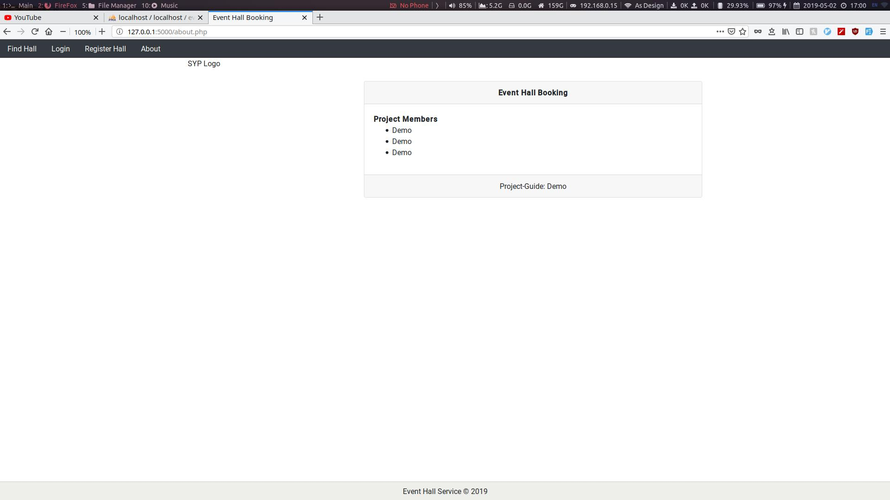

# Event Hall Booking

## Abstract

This is sample Event Hall booking project. I created this project while
learning. Created with PHP(Without any Frameworks). You basically register
Event Halls and then can manage bookings or those halls through admin
login.

## License & Copyrights
You can fully copy or redistribute any part including assets, no License or
credit required. (Optional if you end up using it can provide link to my
webiste as it would help me to gain more traffic. It's totally optional).
This Project uses MIT license.

## Information

#### What is used?
- PHP7, MySQL
- HTML, Bootstrap 4, JQuery

#### Login Info
- Admin:
  - Mobile No.: 9090908080
  - Password  : admin
- Hall:
    - No Halls are registered by default use register screen to create
      some.

#### NOTE
This project is not meant to be used in production. If you want to use it in
real scenario either go over code to remove any security flaws like I stored
passwords in plain text which is not recommended. Although PDO drivers with
parameterised query is used there is no guarntee of full hackerproof safety.

## Want production ready version?
Currently I would not suggest you to use this for anything rather than study or
for really small scale business. But if you want full featured Application you
can hire me thorugh my email(v at kubre dot in) or
[website](https://kubre.in).

## Features
- Search for available event halls in your city.
- Register as Event Hall and can update information through login.
- Admin can see and manage bookings.
- Admin can see and manage halls.

## Screenshots

